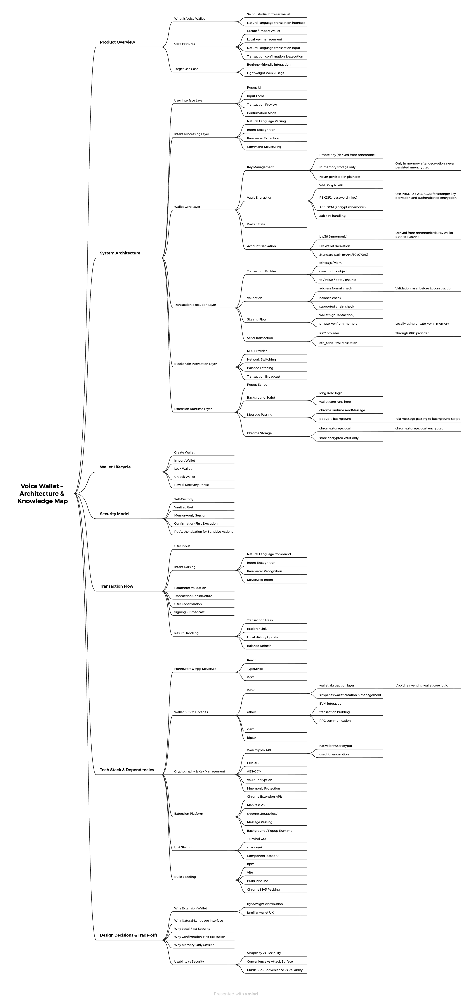

# Voice Wallet — 基于自然语言的 Web3 钱包

---

## 项目资源与演示

### 项目仓库

- GitHub Repository  
  [https://github.com/mxdu-tech/web3-portfolio/tree/main/voice-wallet](https://github.com/mxdu-tech/voice-wallet)

---

### 架构与设计

- Architecture & Knowledge Map  
  

该图展示了系统的整体分层结构，以及各模块之间的关系。

---

### 演示视频

https://youtu.be/CS7R_RBFGTI

---

## 1. 项目简介

Voice Wallet 是一个浏览器端的自托管钱包（Self-Custodial Wallet），支持用户通过自然语言发起链上交易。

与传统钱包需要手动输入地址、金额及 Gas 参数不同，本项目尝试通过自然语言接口，将交易构造过程进行抽象与自动化处理。

系统能够将用户输入转换为结构化交易数据，并完成后续的签名与广播流程。

该项目的核心关注点在于：

- 钱包交互方式的抽象
- 交易构造逻辑的系统化处理
- 在自托管前提下的安全边界设计

---

## 2. 设计背景与问题定义

当前主流 Web3 钱包在使用过程中存在以下问题：

- 交互复杂度高（地址、网络、Gas 参数等需要手动处理）
- 操作流程割裂（跨页面复制、粘贴）
- 对非技术用户不友好
- 输入错误成本高且不可逆

本项目的目标是：

- 将交易构造从用户侧迁移到系统侧
- 提供更自然的交互方式
- 同时保持资产完全由用户控制（Self-Custody）

---

## 3. 系统架构

系统整体采用分层设计，主要包括：

- 用户界面层（UI Layer）
- 意图处理层（Intent Processing Layer）
- 钱包核心层（Wallet Core Layer）
- 交易执行层（Transaction Execution Layer）
- 区块链交互层（Blockchain Interaction Layer）
- 扩展运行层（Extension Runtime Layer）

各层之间通过明确的数据流进行解耦，降低系统复杂度。

---

## 4. 核心模块设计

### 4.1 Wallet Core（钱包核心层）

钱包核心层定义了系统的安全边界，负责私钥管理与账户状态维护。

---

#### Key Management（私钥管理）

- 私钥由助记词（Mnemonic）派生生成（BIP39）
- 解密后仅存在于内存中
- 不进行明文持久化存储

该设计通过减少私钥暴露时间与存储面，降低潜在风险。

---

#### Vault Encryption（加密存储）

系统采用浏览器原生加密能力实现密钥保护：

- Web Crypto API
- PBKDF2（基于密码的密钥派生）
- AES-GCM（对助记词进行加密）

PBKDF2 用于增强弱密码的抗暴力破解能力，AES-GCM 提供机密性与完整性保护。

选择 Web Crypto API 的原因在于：

- 浏览器原生支持，安全性较高
- 减少第三方依赖带来的风险

---

#### Account Derivation（账户派生）

- 使用 HD Wallet（分层确定性钱包）
- 标准路径：m/44'/60'/0'/0/0

该设计保证了与主流钱包（如 MetaMask）的兼容性。

---

### 4.2 Transaction Execution（交易执行层）

交易执行层负责将结构化数据转化为链上交易。

整体流程如下：

User Input → Validation → Signing → Broadcast

---

#### Transaction Builder（交易构造）

使用以下工具完成交易构造：

- ethers.js
- viem

其主要职责包括：

- 构造交易字段（to、value、data、chainId）
- 编码调用数据
- 与 RPC 节点进行交互

---

#### Validation（参数校验）

在交易构造前执行：

- 地址格式校验
- 余额检查
- 网络支持校验

该层用于提前过滤无效输入，避免错误进入签名阶段。

---

#### Signing（签名）

- 在本地完成交易签名
- 使用内存中的私钥

该过程不涉及任何外部传输，确保私钥不离开本地环境。

---

#### Broadcast（交易广播）

- 通过 RPC Provider 发送交易
- 调用标准 JSON-RPC 方法（eth_sendRawTransaction）

---

### 4.3 Blockchain Interaction（链交互层）

该层封装与区块链节点的通信逻辑，包括：

- RPC 请求管理
- 余额查询
- 交易广播

系统并不直接与区块链网络交互，而是通过 RPC 节点完成数据通信。

---

### 4.4 Extension Runtime（扩展运行层）

系统以浏览器扩展形式运行，核心模块包括：

---

#### Background Script

- 常驻执行环境
- 承载钱包核心逻辑

---

#### Message Passing

UI 与后台逻辑通过消息机制通信：

- chrome.runtime.sendMessage

用于实现前端与钱包逻辑的解耦。

---

#### Chrome Storage

- 使用 chrome.storage.local
- 仅存储加密后的数据（Vault）

---

## 5. 交易流程

完整交易链路如下：

1. 用户输入自然语言
2. 系统进行意图解析
3. 提取交易参数（地址、金额等）
4. 参数校验
5. 构造交易
6. 用户确认
7. 本地签名
8. 广播交易
9. 返回结果（交易哈希等）

---

## 6. 技术栈说明

### WDK（Wallet Development Kit）

用于提供钱包抽象能力，包括：

- 钱包创建
- 账户管理
- 签名能力

使用该组件可以避免重复实现底层钱包逻辑。

---

### ethers / viem

用于 EVM 交互的 SDK，主要功能包括：

- 构造交易
- 调用合约
- 与 RPC 节点通信

---

### Web Crypto API

浏览器内置加密模块，用于：

- 助记词加密
- 密钥派生

---

### Chrome Extension API

提供：

- 本地存储能力（chrome.storage）
- 消息通信机制
- 后台运行环境

---

### 前端技术

- React
- TypeScript
- Tailwind CSS

---

## 7. 设计决策与权衡

### 自然语言交互

优点：

- 降低用户使用门槛
- 提供更直观的交互方式

挑战：

- 需要额外的解析层
- 存在语义歧义问题

---

### 自托管模型

优点：

- 用户完全控制资产
- 无需信任第三方

挑战：

- 用户需要承担密钥管理责任

---

### 内存级私钥管理

优点：

- 降低私钥泄露风险

挑战：

- 需要频繁解锁

---

### 浏览器扩展形态

优点：

- 分发简单
- 用户使用习惯成熟

挑战：

- 受浏览器运行环境限制

---

## 8. 后续优化方向

- 多链支持
- 更高精度的自然语言解析
- 交易模拟（Simulation）
- Gas 优化策略

---

## 9. 总结

该项目围绕以下几个核心问题展开：

- 钱包系统的安全边界如何设计
- 用户交互如何从底层协议中解耦
- 在安全性与可用性之间如何进行平衡

Voice Wallet 作为一个实验性实现，提供了一种将自然语言引入 Web3 钱包交互的可能路径。
